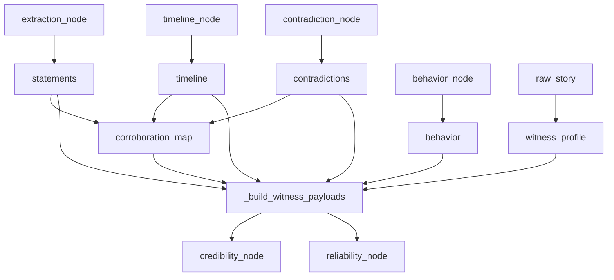

# Wave 2 System Improvements

## Architecture overview

All three data improvements funnel into `_build_witness_payloads()` in [`graph/nodes.py`](Multi%20Agent%20System/graph/nodes.py). The function currently builds payloads with `statements`, `contradictions`, and `behavior`. After this wave, each payload also carries `witness_profile` and `corroborated_events`.



---

## 1. Witness Profile Injection

### What changes

`_build_witness_payloads()` in `nodes.py` currently ignores `state.raw_story`. Add a lookup that finds each witness's description from the anonymized story and injects it as `witness_profile`.

### Code change in `nodes.py` — `_build_witness_payloads`

Build the lookup once before the witness loop:
```python
# Build name → profile from raw_story witnesses
raw_witnesses = state.raw_story.get("witnesses", []) if hasattr(state, "raw_story") else []
profile_lookup = {
    str(w.get("name", "")).strip().lower(): str(w.get("statement", ""))
    for w in raw_witnesses
    if w.get("name") and w.get("statement")
}
```

Then inside the per-witness loop, add to the payload:
```python
witness_profile = profile_lookup.get(witness_key, "")

payload = _deep_normalize({
    "witness": witness,
    "witness_profile": witness_profile,   # NEW
    "statements": witness_statements,
    "contradictions": witness_contradictions,
    "behavior": witness_behavior,
    "corroborated_events": corroborated_events,  # see section 2
})
```

### Prompt updates

Add `witness_profile` to the input contract in both prompts:

In [`prompts/credibility_prompt.py`](Multi%20Agent%20System/prompts/credibility_prompt.py) (`CREDIBILITY_OF_INFORMATION_PROMPT`) — input contract section:
```
"witness_profile": "Description of this witness from the case file. Use to understand their role, access, and how they obtained their information."
```

In [`prompts/reliability_prompt.py`](Multi%20Agent%20System/prompts/reliability_prompt.py) (`RELIABILITY_OF_SOURCE_PROMPT`) — input contract section:
```
"witness_profile": "Narrative description of this witness from the case file. Use to understand their role, vantage point, and potential biases before evaluating their statements."
```

---

## 2. Cross-Witness Corroboration Injection

### Algorithm (deterministic, no LLM)

Add to `_build_witness_payloads()` in `nodes.py`:

**Step A — Build statement_id → witness map:**
```python
stmt_to_witness = {}
for s in statements:
    norm = _deep_normalize(s)
    sid = norm.get("statement_id")
    w = str(norm.get("witness", "")).strip().lower()
    if sid and w:
        stmt_to_witness[sid] = w
```

**Step B — For each event, collect all witnesses (from both event.witnesses and statement_ids):**
```python
event_all_witnesses = {}   # event_id → {"action": str, "witnesses": set}
for e in timeline:
    norm = _deep_normalize(e)
    eid = norm.get("event_id")
    named = {str(w).strip().lower() for w in norm.get("witnesses", [])}
    from_stmts = {
        stmt_to_witness[sid]
        for sid in norm.get("statement_ids", [])
        if stmt_to_witness.get(sid)
    }
    event_all_witnesses[eid] = {
        "action": norm.get("action", ""),
        "witnesses": named | from_stmts
    }
```

**Step C — Per witness: find events with co-witnesses, apply independence check:**

Inside the witness loop (after `witness_contradictions` is built):
```python
# Witnesses this witness is in direct contradiction with
contradicting_keys = set()
for c in witness_contradictions:
    for eid in c.get("event_ids", []):
        for w in event_to_witnesses.get(eid, []):
            contradicting_keys.add(w.lower().strip())

corroborated_events = []
for eid, edata in event_all_witnesses.items():
    co_witnesses = edata["witnesses"] - {witness_key}
    if not co_witnesses:
        continue
    for co_w in co_witnesses:
        shared = co_w in contradicting_keys
        corroborated_events.append({
            "event_id": eid,
            "action": edata["action"],
            "co_witness": co_w,
            "shared_contradiction": shared,
            "independence_note": (
                "These witnesses contradict each other on related events — "
                "treat this corroboration with caution."
                if shared else
                "No direct contradiction found between these witnesses — "
                "assess whether they could have coordinated before counting as independent."
            )
        })
```

### Prompt update — credibility prompt

Add a new section to [`prompts/credibility_prompt.py`](Multi%20Agent%20System/prompts/credibility_prompt.py):

```
"corroborated_events": "Events where at least one other witness reports the same action.
  Each entry includes: event_id, action, co_witness, shared_contradiction (bool), independence_note."
```

Add guidance in the `cross_confirmation` scoring rule:
```
cross_confirmation:
  If corroborated_events is non-empty:
    - Check shared_contradiction. If True, the co-witness and this witness actively contradict
      each other — count the corroboration weakly or not at all.
    - If False, assess whether the witnesses had independent vantage points and no
      opportunity to coordinate their accounts. If genuinely independent: score 0.70–0.90.
    - Two sources who could only know the same fact through coordination are NOT independent.
  Base (no corroborated_events): 0.30–0.50.
```

---

## 3. Missing Witness Fallback Extraction

### What changes

In `extraction_node` in `nodes.py`, after the main batched extraction completes, compare the extracted witness names against every witness listed in `raw_story["witnesses"]`. For any witness with zero extracted statements, synthesise a single statement directly from their `statement` field in the anonymized story.

### Code addition at end of `extraction_node`:
```python
# Fallback: any witness in the raw story with 0 extracted statements
extracted_names_lower = {
    str(s.get("witness", "") if isinstance(s, dict) else s.witness).strip().lower()
    for s in result
}

fallback_statements = []
sid_counter = len(result) + 1

for w in witnesses:
    wname = str(w.get("name", "")).strip()
    wstmt = str(w.get("statement", "")).strip()
    if not wname or not wstmt:
        continue
    if wname.lower() not in extracted_names_lower:
        log.info(f"[extraction] Fallback statement for witness with 0 extractions: {wname}")
        fallback_statements.append({
            "statement_id": f"S{sid_counter:03d}",
            "witness": wname,
            "raw_text": wstmt,
            "subject": None,
            "time": None,
            "location": None,
            "action": None,
            "context": "Synthesised from witness case-file description — no direct statements extracted."
        })
        sid_counter += 1

result = result + fallback_statements
```

This recovers Marceau Lorne, Commander Esten Marrick, and Livia Marr's kitchen maid without an extra LLM call.

---

## 4. Retraction Severity — Prompt Nuance

### What changes

Replace the blunt "single retraction = sufficient for E" sentence in [`prompts/reliability_prompt.py`](Multi%20Agent%20System/prompts/reliability_prompt.py) (`RELIABILITY_OF_SOURCE_PROMPT`) with context-sensitive reasoning guidance:

```
Assign E when retraction is CENTRAL: The retracted claim directly affected the established
time of death, the murder weapon, or the murderer's alibi. One such retraction is sufficient.

Assign D when retraction is PERIPHERAL: The retracted claim was self-protective about a
secondary matter (e.g., concealing embarrassing personal conduct, hiding unrelated activity
during the relevant period) and does not alter the core murder timeline. Combined with other
mild indicators, D is appropriate.

Do NOT apply E automatically to every retraction. Assess what the retracted claim covered
before deciding its severity.
```

---

## Affected Files Summary

| File | Change |
|---|---|
| [`graph/nodes.py`](Multi%20Agent%20System/graph/nodes.py) | Add profile lookup, corroboration map, and independence check to `_build_witness_payloads`; add fallback extraction loop to `extraction_node` |
| [`prompts/credibility_prompt.py`](Multi%20Agent%20System/prompts/credibility_prompt.py) | Add `witness_profile` and `corroborated_events` to input contract + corroboration independence scoring guidance |
| [`prompts/reliability_prompt.py`](Multi%20Agent%20System/prompts/reliability_prompt.py) | Add `witness_profile` to input contract + retraction severity nuance |
